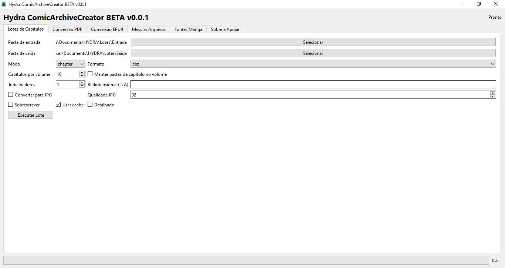
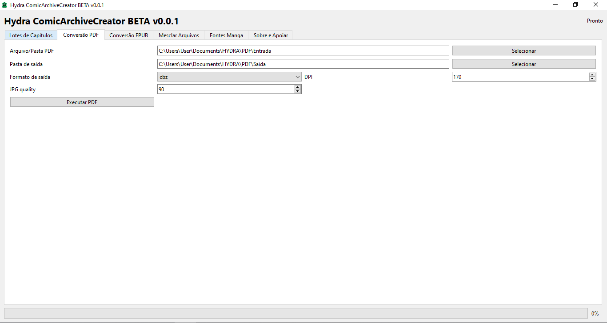
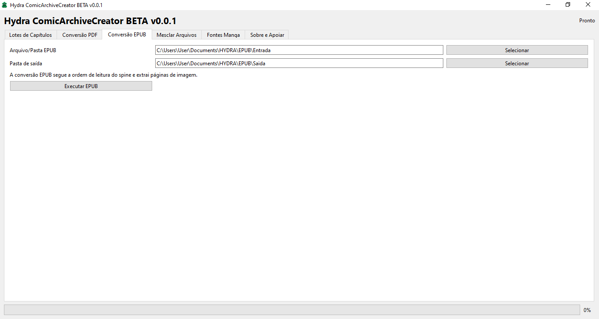
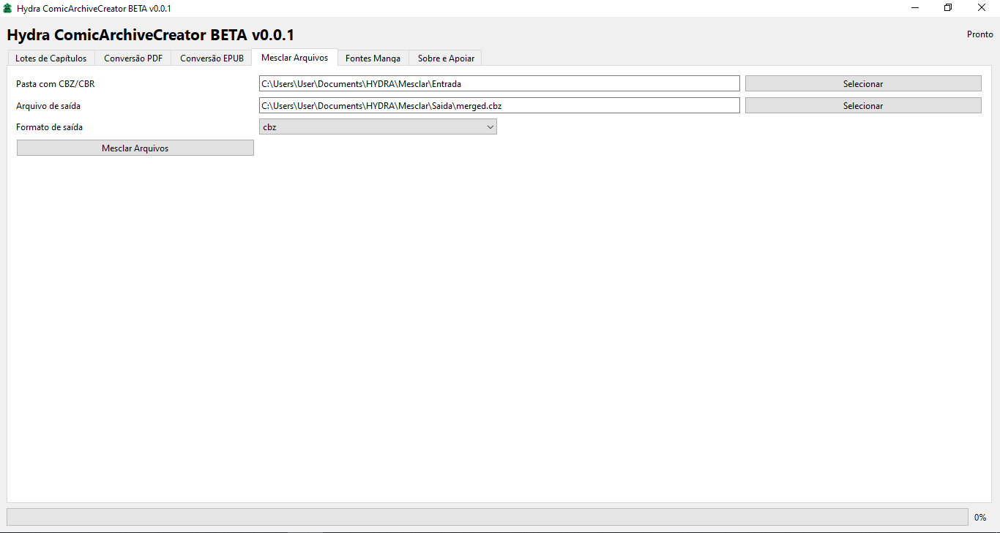
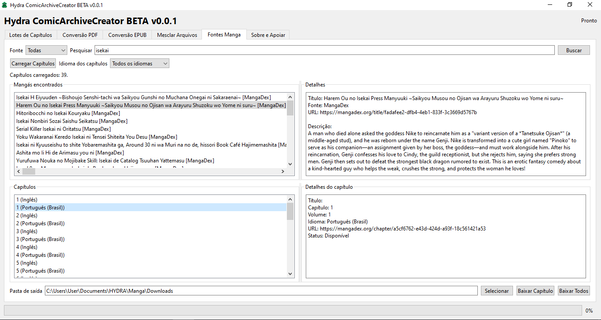
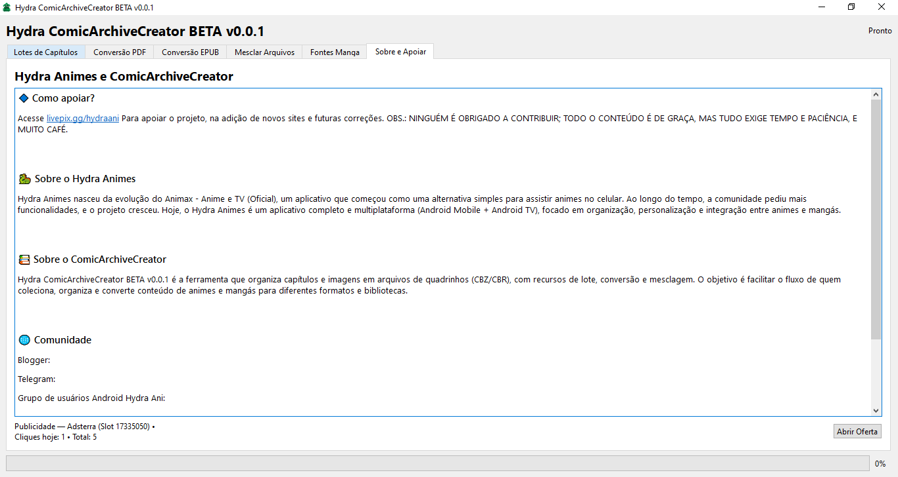

<h1 align="center">🐉 Hydra ComicArchiveCreator BETA</h1>

<h3 align="center">Organize, convert, and download your manga and comics in CBZ/CBR — all in one place.</h3>

<p align="center">
  
  
  
  
  
  
</p>

---

## 📖 About the project

**Hydra ComicArchiveCreator BETA** is a desktop application for Windows made for those who
collect, organize, and convert **manga/comic chapters** into digital reading files in the
**CBZ** and **CBR** formats (compatible with readers such as CDisplayEx, YACReader, Komga,
Kavita, Moon+ Reader, Tachiyomi, and similar).

With it, you can — without using the command line and without installing anything:

- 📦 Combine loose image chapters into **organized CBZ/CBR files**;
- 📚 Automatically group chapters into **volumes**;
- 🖼️ Convert **PDF** and **EPUB** into digital comics;
- 🧩 **Merge** multiple CBZ/CBR files into a single file;
- 🔎 **Search for manga** on online sources and **download chapters** choosing the language;
- ⚙️ Resize, convert to JPG, and optimize images.

> This repository distributes **only the executable (.exe)**.
> **The source code is not public.** The application is free.

---

## ⬇️ Download

1. Go to the **[Releases](https://github.com/wwlvdev/HydraComicArchiveCreator/releases/latest)** tab.
2. Download the file **`HydraComicArchiveCreatorBETA_v0.0.1.zip`**.
3. Extract the ZIP to any folder.
4. Double-click **`HydraComicArchiveCreatorBETA.exe`** and you're done! ✅

**No need to install** Python, libraries, or any other program.
The application is **portable**: it can live on a USB drive and works on any PC.

---

## 💻 Requirements

| Item | Detail |
|---|---|
| System | **Windows 10 or Windows 11 (64-bit)** |
| Disk space | ~200 MB free (for the first run) |
| Internet | Required only to search/download manga |
| WinRAR | **Optional** — required only to generate `.cbr` files |

---

## 🖼️ Application screenshots

### Main screen — Chapter Batches


### PDF Conversion


### EPUB Conversion


### Merge Files


### Manga Sources (search and download)


### About and Support


---

## ✨ What each function does

### 📦 "Chapter Batches" tab — create CBZ/CBR in batch

The main tool. Point it to a folder with several chapters (subfolders with images) and it
generates the reading files automatically.

| Field | What it does |
|---|---|
| **Input folder** | Root folder where the chapters are (each subfolder = 1 chapter). |
| **Output folder** | Where the CBZ/CBR files will be saved. |
| **Mode** | `chapter` = 1 file per chapter · `volume` = groups chapters into volumes. |
| **Format** | `cbz` (ZIP, needs nothing) or `cbr` (RAR, requires WinRAR installed). |
| **Chapters per volume** | How many chapters go into each volume (default: **10**). |
| **Keep chapter folders in volume** | Keeps the chapter separation inside the volume. |
| **Workers** | How many tasks process in parallel (default: half of the CPU cores). |
| **Resize (WxH)** | Resizes the images. E.g.: `1600x2400`. Leave empty to not change. |
| **JPG quality** | JPG conversion quality (0–100, default: **92**). |
| **Convert to JPG** | Converts all images to `.jpg` before building the file. |
| **Overwrite** | Regenerates files that already exist in the output folder. |
| **Use cache** | Skips chapters that haven't changed since the last run (default: **on**). |
| **Verbose** | Shows more detailed processing messages. |
| **Run Batch** | Starts processing. |

**Highlights:** parallel processing, low memory usage (streaming), skips corrupted
images with a warning, and smart cache to avoid repeating work.

### 📄 "PDF Conversion" tab — PDF → CBZ/CBR

Converts PDF chapters to the digital comic format.

| Field | What it does |
|---|---|
| **PDF File/Folder** | Select **a single PDF** or an **entire folder** with several PDFs. |
| **Output folder** | Where the converted files will be saved. |
| **Output format** | `cbz` or `cbr`. |
| **DPI** | Resolution of the rendered pages (default: **170**). Higher = better quality and larger file. |
| **JPG quality** | Quality of the generated images (default: **90**). |
| **Run PDF** | Starts the conversion. |

### 📚 "EPUB Conversion" tab — EPUB → CBZ

Converts `.epub` eBooks (including manga/comics in EPUB) to **CBZ**.

| Field | What it does |
|---|---|
| **EPUB File/Folder** | Select **a single EPUB** or a **folder** with several. |
| **Output folder** | Where the CBZ files will be saved. |
| **Run EPUB** | Starts the conversion. |

> The conversion follows the EPUB's **reading order (spine)** and extracts the image pages.

### 🧩 "Merge Files" tab — join CBZ/CBR

Joins multiple files into **a single** comic file.

| Field | What it does |
|---|---|
| **Folder with CBZ/CBR** | Folder containing the files to merge. |
| **Output file** | Path and name of the final file. |
| **Output format** | `cbz` or `cbr`. |
| **Merge Files** | Generates the unified file. |


### 🔎 "Manga Sources" tab — search and download chapters

Searches for manga on online sources and downloads chapters directly to your PC.

| Field | What it does |
|---|---|
| **Source** | `All`, `MangaDex`, `NoIndexScan`, `PinkRosa`, or `MangaBall`. |
| **Search** | Search term (manga title) + **Search** button. |
| **Manga found** | List of results. Click a result to see the details. |
| **Details** | Title, source, URL, and description of the selected manga. |
| **Load Chapters** | Loads the chapter list of the chosen manga. |
| **Chapter language** | Language selector: *All*, **Portuguese (Brazil)**, Portuguese (Portugal), English, and Spanish. |
| **Chapters** | List of chapters (shows the language of each one). |
| **Chapter details** | Title, number, volume, language, URL, and status of the chapter. |
| **Output folder** | Where the downloaded chapters will be saved. |
| **Download Chapter** | Downloads only the selected chapter. |
| **Download All** | Downloads all valid chapters in the list. |

**About the language selector:** when you choose a language, the search is already filtered
at the source (MangaDex/MangaBall), avoiding lists with mixed-language chapters. Changing the
language reloads the list automatically.

### 💚 "About and Support" tab

Project information, ways to support development (LivePix), community, and the
**advertising** block that keeps the app free.

---

## 🗂️ Folders created automatically

On the first run, the app creates an organized structure in
`Documents\HYDRA\`:

```
Documents\
└── HYDRA\
    ├── Lotes\
    │   ├── Entrada\      ← put the chapters here
    │   └── Saida\        ← generated CBZ/CBR files
    ├── PDF\
    │   ├── Entrada\
    │   └── Saida\
    ├── EPUB\
    │   ├── Entrada\
    │   └── Saida\
    ├── Mesclar\
    │   ├── Entrada\
    │   └── Saida\
    └── Manga\
        └── Downloads\    ← chapters downloaded from sources
```

> All paths are editable: you can use any folder on your computer.

---

## 🚀 How to use (step by step)

### Create CBZ from loose chapters
1. Open the **Chapter Batches** tab.
2. Select the **Input folder** (with the chapters) and the **Output folder**.
3. Choose the **Mode** (`chapter` or `volume`) and the **Format** (`cbz`/`cbr`).
4. (Optional) Adjust resizing, quality, and conversion to JPG.
5. Click **Run Batch** and wait for the progress bar.

### Convert PDF to CBZ
1. **PDF Conversion** tab → select the file or the folder of PDFs.
2. Set the **Output folder** and the **Output format**.
3. Adjust the **DPI** as desired and click **Run PDF**.

### Download a manga
1. **Manga Sources** tab → choose the **Source** and type the manga name.
2. Click **Search** and select the correct result.
3. Choose the **Chapter language** and click **Load Chapters**.
4. Select the **Output folder** and click **Download Chapter** (or **Download All**).

---

## 💡 Tips and limitations

- **CBR requires WinRAR** installed on the PC. If you don't have it, use **CBZ** (works in any reader).
- The **first launch** may take a few extra seconds (the app prepares in the background);
  the next ones open faster.
- When opening, Windows may show the **"Windows protected your PC"** warning (SmartScreen).
  This is normal for free programs without a digital certificate: click
  **"More info" → "Run anyway"**.
- Chapters marked as **[Unavailable]** or **[External]** cannot be downloaded by the app.
- Online sources may be temporarily under maintenance — try again later.


---

## ❓ Frequently asked questions (FAQ)

**Does the app need Python or any installation?**
No. The executable is fully standalone: just download and run.

**Is it safe? My antivirus complained.**
Some antivirus programs warn out of caution about new/portable programs without a digital
signature. The app only organizes/converts your files and downloads from public manga
sources. You can add the app folder as an exception in your antivirus, if you wish.

**Does it work on 32-bit Windows, Linux, or Mac?**
Currently **no**. This version is for **64-bit Windows 10/11**.

**Where are the files saved?**
In the folder you choose. By default, everything is organized in `Documents\HYDRA\`.

**Can I disable the ad?**
The ad appears at most **once a day**, when the app starts, and it's what keeps the project
free. It never opens windows on its own besides that one, and it doesn't collect your data.

**Does the application download manga on its own?**
It queries the sources at the moment you search/choose — nothing is downloaded without your action.

**Does it work with any image format?**
Yes: JPG, PNG, WebP, BMP, GIF, TIFF — the app converts/validates automatically.

---

## 💚 Support the project

Hydra ComicArchiveCreator is **free** and maintained by the community. If it helps you,
consider supporting development:

- 💙 **LivePix:** [livepix.gg/hydraani](https://livepix.gg/hydraani)

Your help keeps the servers running, the sources updated, and new features coming. 🐉

---

## 🌐 Community

- 📝 **Blogger:** 
- 💬 **Telegram:** 
- 🤖 **Hydra Ani Android Group:** [t.me/+p7-RyWDRRVhlMTdh](https://t.me/+p7-RyWDRRVhlMTdh)

---

## 📋 Changelog

### v0.0.1 (BETA) — first public version
- 📦 CBZ/CBR creation by chapter or by volume, with parallel processing.
- 🖼️ Resizing and conversion to JPG with adjustable quality.
- 🔁 Smart cache to skip unchanged files.
- 📄 Conversion of **PDF** and **EPUB** to CBZ/CBR.
- 🧩 Merging multiple CBZ/CBR into one file.
- 🔎 Search on **MangaDex, NoIndexScan, PinkRosa, and MangaBall**.
- 🌍 **Chapter language selector** (All, pt-BR, pt-PT, English, Spanish).
- ⬇️ Download of individual chapters or all at once.
- 🆓 Portable installer (~80 MB) — no installation required.
- 🎨 Custom icon and visual identity.

---

## ⚖️ License and legal notice

- **License:** *Freeware* — the application is free for personal use.
  **The source code is not publicly distributed**; this repository publishes only the
  official executables. Reselling or modified redistribution without authorization is prohibited.
- **Legal notice:** the application **hosts no content**. It only organizes, converts, and
  downloads files from public third-party sources. All downloaded content is the user's
  responsibility and must respect the copyright laws of your country. Support the official
  authors and publishers whenever possible.
- **Privacy:** the application does not collect personal data. The advertising shown
  (Adsterra) is a third-party ad opened in the browser, at most once a day.

---

<p align="center">
  Made with 💙 and ☕ by <b>Hydra Animes</b><br>
  <i>Hydra ComicArchiveCreator BETA v0.0.1</i>
</p>

<p align="center">
  <a href="https://livepix.gg/hydraani"></a>
  <a href="https://t.me/+p7-RyWDRRVhlMTdh"></a>
</p>
